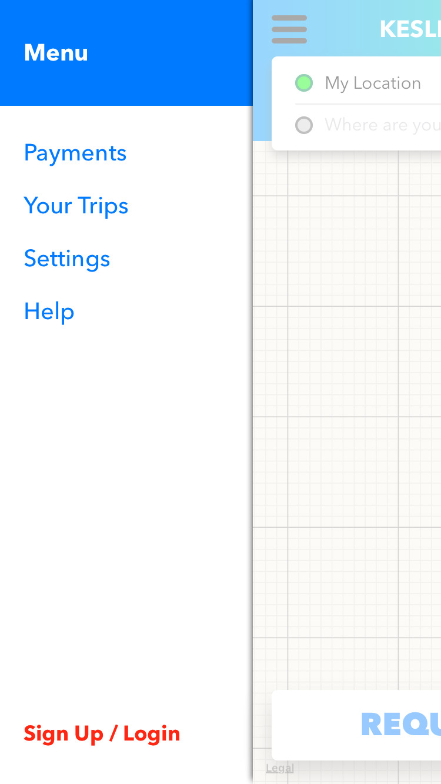

# Rideshare_Car_iOS_App

**Advanced iOS** app with **Firebase/Google**. It's an example code using **Swift 5**, **Xcode 11** and **iOS 12**.
This app has some features similar to the **UBER** app. The name is **_Rideshare Car_**.

More updates soon, follow me!

## SOME SCREEN SHOTS (More pics soon):

